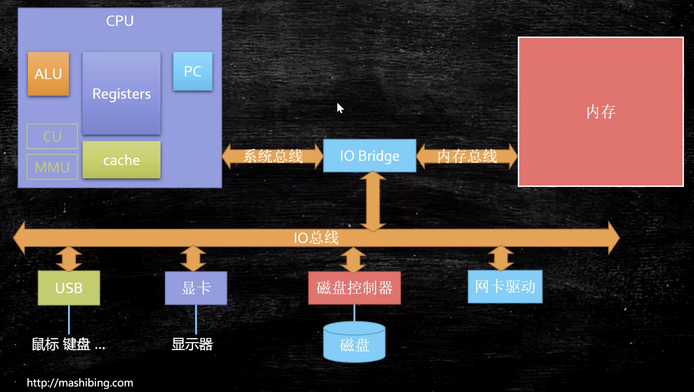

# 硬件基础知识

关于底层的细节：适度打开  
保持黑箱即可，因为打开这个黑箱你就会发现打开的其实是个黑洞，吞噬时间和精力无法自拔。为什么要打开，就是要准备面试

## CPU的制作

Intel cpu的制作过程：
https://haokan.baidu.com/v?vid=11928468945249380709&pd=bjh&fr=bjhauthor&type=video

CPU是如何制作的（文字描述）：
https://www.sohu.com/a/255397866_468626
特别复杂，100多个工序，都特别复杂，其中就包括光刻，只有荷兰ASML有7nm光刻机。我们被"卡脖子"只是手机高端芯片。需要持续投入大量金钱、产出又
比较慢、周期长的，由国家做投资主持，再加上我们没有下发优势和美国的打压，芯片必须走举国体制的道路。谁要是拿着"汉芯"和"弘芯"反驳，那就是
欠抽 （😂）就盼着美国对中国禁运芯片，禁运个两三年，等中国自己的芯片产业发展起来了，你再想进入中国市场，对不起，没戏了。而且在这禁运的几年中，
美国芯片企业还要面临销售额剧烈萎缩，他们60-70%的产能被中国市场消费了，这几年中你三分之二的利润没了，还想活吗？能发得出工资来吗？而且期间
还不断有中国公司来挖高端芯片人才，你养不起人才就不得不放人。所以美国对中国禁运芯片，我们真的求之不得。连操作系统也禁运了才好。只要是有竞争
的领域，买东西的一定是老大，不可能让卖东西的卡住买东西的脖子。跑题了，下面书归正传

## CPU的原理

计算机需要解决的最根本问题：如何代表数字。  
晶体管是如何工作的：https://haokan.baidu.com/v?vid=16026741635006191272&pd=bjh&fr=bjhauthor&type=video
晶体管的工作原理：
https://www.bilibili.com/video/av47388949?p=2

最初的是各种门电路组成的加法器、累加器、锁存器等等，手动计算，通一次电计算一次。后来用晶体的震荡来决定通断电。CPU有好多腿（比如64个），
每个针脚读入高低电平（1/0），从内存读入这些0和1，作为计算的输入数据，然后时钟震荡一下就从总线中读进（64/32位）数据来计算一次。对计算机
进行输入，就是告诉计算机的各个真叫，哪个该通电、哪个该断电。  

## 汇编语言（机器语言）的执行过程
汇编语言就是机器语言的助记符。

汇编语言的本质：机器语言的助记符 其实它就是机器语言
计算机通电 -> CPU读取内存中程序（电信号输入）
->时钟发生器不断震荡通断电 ->推动CPU内部一步一步执行
（执行多少步取决于指令需要的时钟周期）
->计算完成->写回（电信号）->写给显卡输出（sout，或者图形）

## 量子计算机

量子比特，同时表示1 0

## CPU的基本组成
如图：

PC -> Program Counter 程序计数器 （记录当前指令地址）  
Registers -> 暂时存储CPU计算需要用到的数据  
ALU -> Arithmetic & Logic Unit 运算单元  
CU -> Control Unit 控制单元  
MMU -> Memory Management Unit 内存管理单元  
cache: L1,L2(在每个core之内都有)，L3（同一个CPU的各个core共享），速度依次下降  
  
GPU为什么比CPU更适合做机器学习？因为前者是专用芯片而后者是通用芯片，前者的结构更适合于做单纯的AI计算。现在华为、阿里等公司还在设计，专门的
AI芯片，比如NPU。这就更加专业化了，AI计算更加快速。