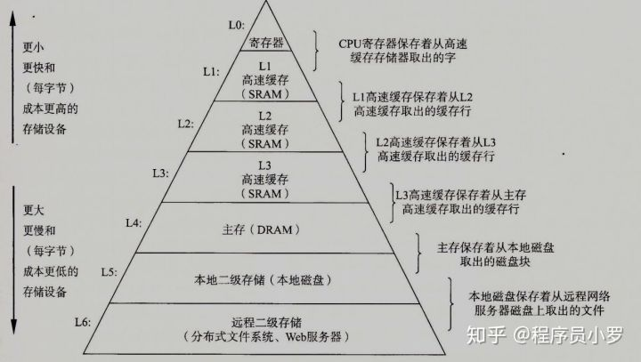

# Java相关的硬件知识

CPU和内存是计算机的核心

## CPU内的各个组件

PC -> Program Counter 程序计数器 （记录当前指令在内存中的地址，找下一条指令的时候并不是简单的加一，要看指令的长度）  
Registers -> 暂时存储CPU计算需要用到的数据，CPU的一等公民。现在有几十上百个，写汇编要知道每一个寄存器是干什么的。现在是64位寄存器
             JVM的本地变量表就相当于是JVM的寄存器了，但是速度没法跟真实的寄存器相比  
ALU -> Arithmetic & Logic Unit 运算单元。具体怎么运算呢？mov ax 2，mov bx 3，然后add，就自动去ax和bx中找两个加数，然后运算，
       最后输出到一个寄存器中，再把其值写到内存中的某个地址  
CU -> Control Unit 控制单元。对终端信号等做控制的。  
MMU -> Memory Management Unit 内存管理单元。最早的内存管理都是操作系统软件实现的，现在都是硬件+操作系统实现的，后面讲到再说  
cache: L1,L2(在每个core之内都有)，L3（同一个CPU的各个core共享），速度依次下降  
  
什么是超线程？特别简单：一个ALU对应着多组寄存器（Register）和程序计数器（PC）。如果只有一组，就得在线程切换执行的时候，把当前Register和PC
的数据复制到缓存，然后把另一个线程的响应的数据复制进Register和PC，再执行，如此往复。如果有两套Register和PC，ALU只需要转向另一套就可以实现
线程之间的切换执行了，不用来回复制，提高了效率。
  
GPU为什么比CPU更适合做机器学习？因为前者是专用芯片而后者是通用芯片，前者的结构更适合于做单纯的AI计算。现在华为、阿里等公司还在设计，专门的
AI芯片，比如NPU。这就更加专业化了，AI计算更加快速。  

CPU与外设靠系统总线、IO bridge和IO总线联系起来，一旦外设有输入，就会产生CPU中断。

## 各种存储器的层次结构

各个级别的存储结构其速度排序如下图：

高速缓存结构：  

  
CPU访问寄存器、各级缓存和内存的速度：  
存储器|访问时间
---- | ---
Registers| <1ns
L1 Cache|约1ns
L2 Cache|约3ns
L3 Cache|约15ns
Main Memory|约80ns

### 缓存的读取方式
按块读取，由于程序局部性原理（当用到某些数据的时候，它旁边的也会被用到），按块，而不是按位或者字节读取效率更高，充分发挥总线CPU针脚等一次性
读取更多数据的能力。按块读取的原理不管是从硬盘往内存读，还是从内存往缓存读，都是这个原理。从硬盘读数据到内存的时候，用的是DMA（Direct 
Memory Access），而不是走CPU。按块读取的时候，块的大小有的是自定义的，有的是被写死了的。  

缓存是一行行读的，读一个数据的时候，先去L1找，再去L2找，然后L3、内存，然后把内存读出的数据依次缓存到L3、L2、L1。工程测试，这么做最合适。
如果x、y位于同一个缓存行，Core1需要用到x，Core2需要用到y，则x、y以及他们所在的这个缓存行整体都会被读到两个Core的各级缓存。如果同一个缓存
行的数据数据需要同步，则要内存一致性协议（MESI）或者锁总线保证。保持缓存一致性是指：一旦一个CPU改了缓存行中的一个数据，他要告诉另外的CPU，
这一行数据已经过时了，请重新再去内存里读一遍。  

#### MESI
四种状态：Modified、Exclusive、Shared、Invalid。在一个CPU里面的缓存行是Modified，修改过了，则在里一个中就是Invalid，要重新读取。文本
特别繁琐，不用看。除了MESI之外，还有很多缓存一致性协议：MOSI、MSI、Synapse、Firefly、Dragon

#### 锁总线
有的数据一个缓存行装不下，这个时候就去锁定总线，肯定就没有数据不一致的情况了，但是跟MESI相比效率低，能用MESI的就用MESI

#### 缓存行的大小
缓存行越大，局部性空间效率越高，但是读取时间慢；缓存行越小，局部空间效率越低，但是读取时间快。取个折中值，目前多用64字节。

#### 缓存行对齐的编程方式
在Distruptor中，在long cursor的前后都加上7个long，保证他绝对不会跟其他的数据放到同一个缓存行里。加上@Contended也可以保证这个变量跟
别的变量不在同一个缓存行, 但是JVM要设置参数：`-XX:-RestrictContended`. @Contended可以根据底层的CPU缓存行的长度设定，办证变量独占一个
缓存行

### "乱序"执行

指令1先执行，去读内存并等待返回，内存和缓存速度的比大概是100 : 1, 为了提高效率，如果下一条指令2跟指令1没有关系，则会去先执行指令2，在程序
看来是指令2先执行，指令1后执行，虽然写的时候是指令1在前面。volatile关键字可以避免这种指令重排序。汇编指令new：只会申请一块空间，不会给成员
变量赋值，只有执行了invokespecial之后，才会赋初值，new的时候会在栈里面有一个引用指向new的对象，而dup命令会在栈顶复制一个引用，也指向这个
对象。这是因为后面的invokespecial会消耗一个值，把存在栈顶的这个值弹出来，调用它指向的这个对象的构造方法。astore_1是把栈顶的值弹出来，赋值
给局部变量表排在第一位的变量（位置为0的是this）。

### CPU层面如何禁止指令重排
答：内存屏障。对某一部分内存操作的时候，前后添加的屏障，屏障前后的操作不可以乱序执行屏障上面的命令全执行完了，才可以执行屏障下面的命令。
Intel底层通过lfence、sfence、mfence，分别是读（load）、写（save）和读写屏障（mixed）。当然也可以通过总线锁来实现。volatile并不是用的
这里的原语实现的，而是lock指令（锁屏障）