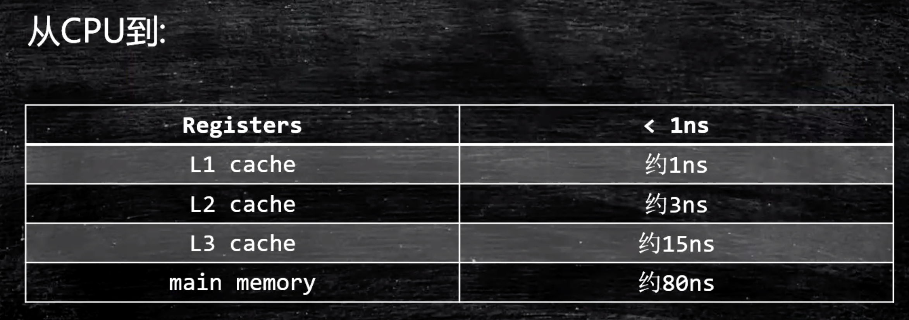

# Java相关的硬件知识

CPU和内存是计算机的核心

## CPU内的各个组件

PC -> Program Counter 程序计数器 （记录当前指令在内存中的地址，找下一条指令的时候并不是简单的加一，要看指令的长度）  
Registers -> 暂时存储CPU计算需要用到的数据，CPU的一等公民。现在有几十上百个，写汇编要知道每一个寄存器是干什么的。现在是64位寄存器
             JVM的本地变量表就相当于是JVM的寄存器了，但是速度没法跟真实的寄存器相比  
ALU -> Arithmetic & Logic Unit 运算单元。具体怎么运算呢？mov ax 2，mov bx 3，然后add，就自动去ax和bx中找两个加数，然后运算，
       最后输出到一个寄存器中，再把其值写到内存中的某个地址  
CU -> Control Unit 控制单元。对终端信号等做控制的。  
MMU -> Memory Management Unit 内存管理单元。最早的内存管理都是操作系统软件实现的，现在都是硬件+操作系统实现的，后面讲到再说  
cache: L1,L2(在每个core之内都有)，L3（同一个CPU的各个core共享），速度依次下降  
  
什么是超线程？特别简单：一个ALU对应着多组寄存器（Register）和程序计数器（PC）。如果只有一组，就得在线程切换执行的时候，把当前Register和PC
的数据复制到缓存，然后把另一个线程的响应的数据复制进Register和PC，再执行，如此往复。如果有两套Register和PC，ALU只需要转向另一套就可以实现
线程之间的切换执行了，不用来回复制，提高了效率。
  
GPU为什么比CPU更适合做机器学习？因为前者是专用芯片而后者是通用芯片，前者的结构更适合于做单纯的AI计算。现在华为、阿里等公司还在设计，专门的
AI芯片，比如NPU。这就更加专业化了，AI计算更加快速。  

CPU与外设靠系统总线、IO bridge和IO总线联系起来，一旦外设有输入，就会产生CPU中断。

## 各种存储器的层次结构

各个级别的存储结构其速度排序如下图：

高速缓存结构：  

看个更直观的：  

寄存器、各级缓存和内存的速度：  

